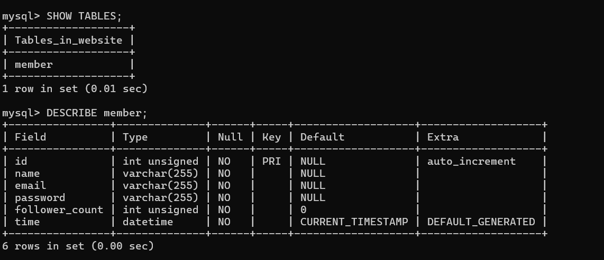
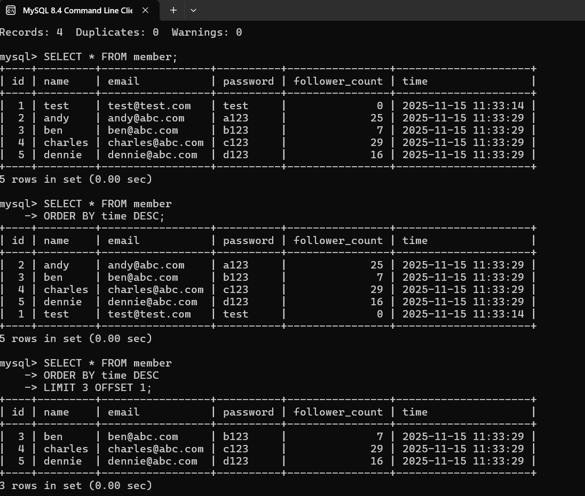
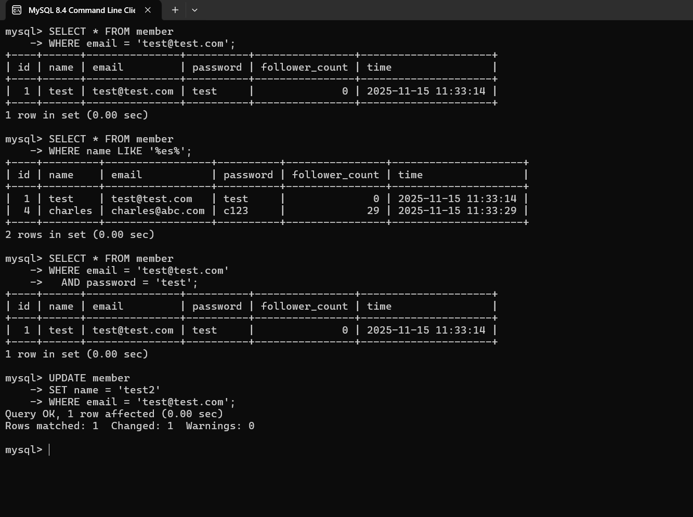
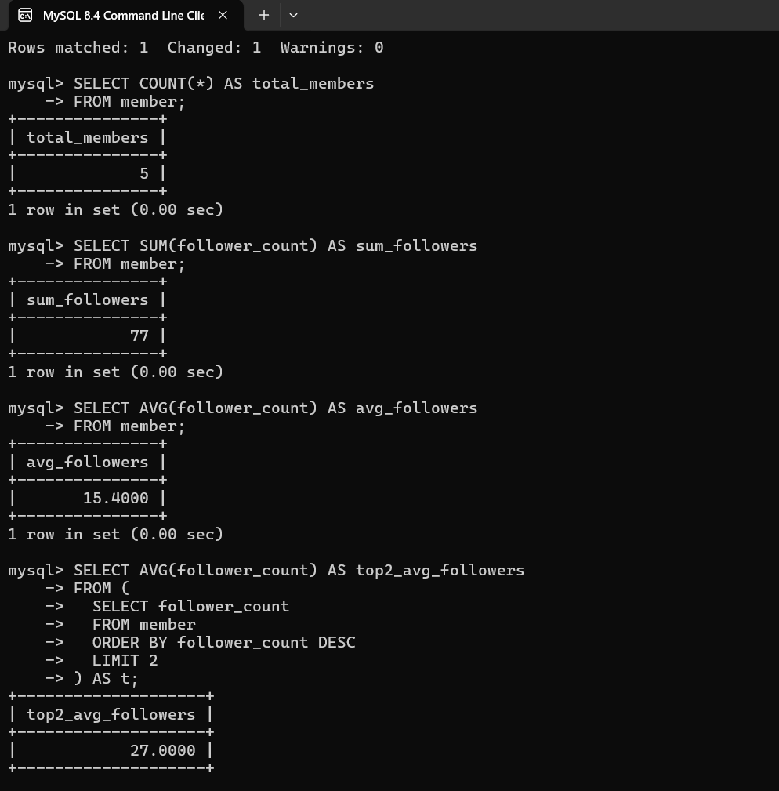
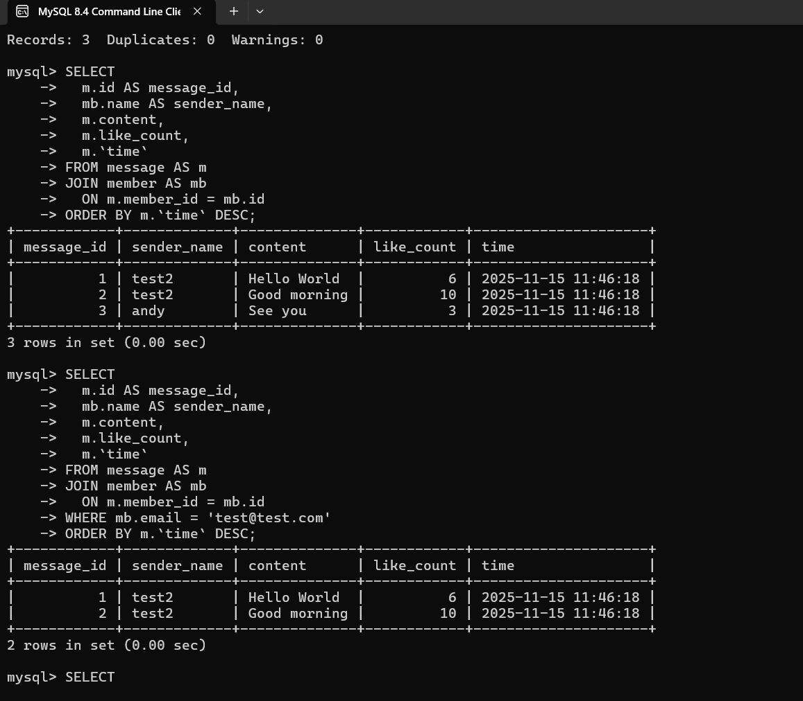

Week 5 — MySQL Tasks
Task 2 

CREATE DATABASE website;

USE website;

CREATE TABLE member (
  id INT UNSIGNED AUTO_INCREMENT PRIMARY KEY,
  name VARCHAR(255) NOT NULL,
  email VARCHAR(255) NOT NULL,
  password VARCHAR(255) NOT NULL,
  follower_count INT UNSIGNED NOT NULL DEFAULT 0,
  `time` DATETIME NOT NULL DEFAULT CURRENT_TIMESTAMP
);

SHOW TABLES;
DESCRIBE member;

Task 3 — 

INSERT INTO member (name, email, password)
VALUES ('test', 'test@test.com', 'test');

INSERT INTO member (`name`, `email`, `password`, `follower_count`)
VALUES
  ('andy','andy@abc.com','a123', 25),
  ('ben','ben@abc.com','b123', 7),
  ('charles','charles@abc.com','c123', 29),
  ('dennie','dennie@abc.com','d123', 16);

SELECT * FROM member;

SELECT * FROM member
ORDER BY time DESC;

SELECT * FROM member
ORDER BY time DESC
LIMIT 3 OFFSET 1;

SELECT * FROM member
WHERE email = 'test@test.com';

SELECT * FROM member
WHERE name LIKE '%es%';

SELECT * FROM member
WHERE email = 'test@test.com'
  AND password = 'test';

UPDATE member
SET name = 'test2'
WHERE email = 'test@test.com';

Task 4

SELECT COUNT(*) AS total_members
FROM member;

SELECT SUM(follower_count) AS sum_followers
FROM member;

SELECT AVG(follower_count) AS avg_followers
FROM member;

SELECT AVG(follower_count) AS top2_avg_followers
FROM (
  SELECT follower_count
  FROM member
  ORDER BY follower_count DESC
  LIMIT 2
) AS t;

Task 5

DROP TABLE IF EXISTS message;

CREATE TABLE message (
  id INT UNSIGNED AUTO_INCREMENT PRIMARY KEY,
  member_id INT UNSIGNED NOT NULL,
  content TEXT NOT NULL,
  like_count INT UNSIGNED NOT NULL DEFAULT 0,
  `time` DATETIME NOT NULL DEFAULT CURRENT_TIMESTAMP,
  CONSTRAINT fk_message_member
    FOREIGN KEY (member_id)
    REFERENCES member(id)
    ON DELETE CASCADE
    ON UPDATE CASCADE
) ENGINE=InnoDB
  DEFAULT CHARSET = utf8mb4
  COLLATE = utf8mb4_unicode_ci;

INSERT INTO message (member_id, content, like_count)
VALUES
  (1, 'Hello World', 6),
  (1, 'Good morning', 10),
  (2, 'See you', 3);

SELECT
  m.id AS message_id,
  mb.name AS sender_name,
  m.content,
  m.like_count,
  m.`time`
FROM message AS m
JOIN member AS mb
  ON m.member_id = mb.id
ORDER BY m.`time` DESC;

SELECT
  m.id AS message_id,
  mb.name AS sender_name,
  m.content,
  m.like_count,
  m.`time`
FROM message AS m
JOIN member AS mb
  ON m.member_id = mb.id
WHERE mb.email = 'test@test.com'
ORDER BY m.`time` DESC;

SELECT
  AVG(m.like_count) AS avg_like_count_for_test
FROM message AS m
JOIN member AS mb
  ON m.member_id = mb.id
WHERE mb.email = 'test@test.com';

SELECT
  mb.email,
  AVG(m.like_count) AS avg_like_count,
  COUNT(*) AS message_count
FROM message AS m
JOIN member AS mb
  ON m.member_id = mb.id
GROUP BY mb.email
ORDER BY avg_like_count DESC;

